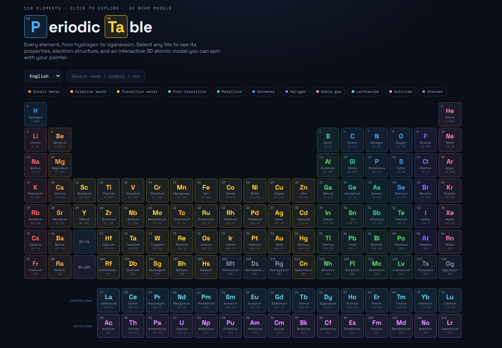
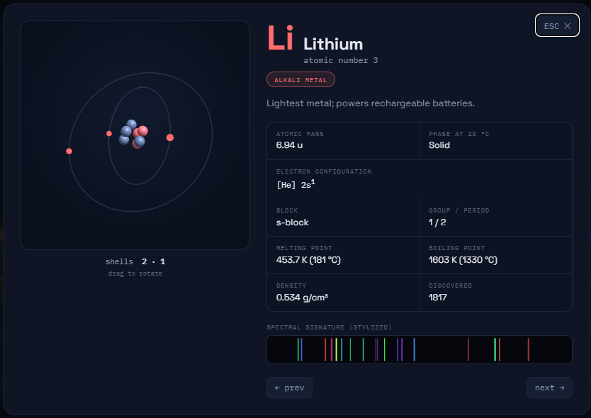
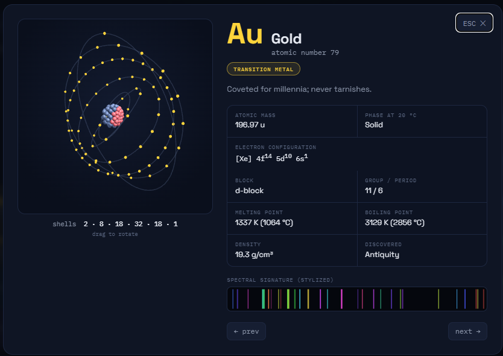
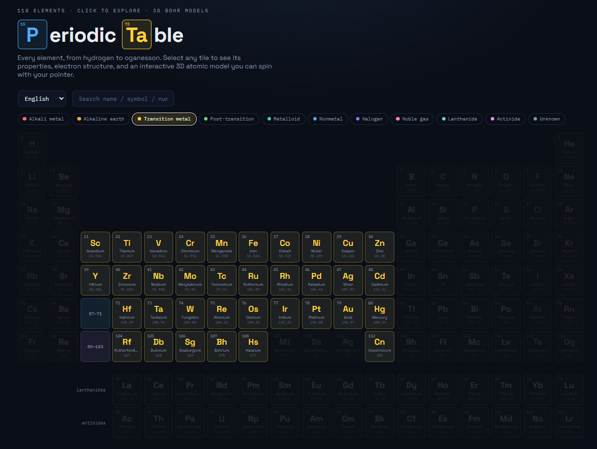

# Interactive 3D Periodic Table

A single-file, dependency-light periodic table of all **118 elements** — every tile opens a detail view with element data, computed electron structure, and an interactive **3D Bohr atomic model** you can spin with your pointer. Fully multilingual.

Everything lives in one file: [`periodic-table.html`](periodic-table.html). No build step, no install — just open it in a browser.

## Tools and prompt
Created using **Claude Fable 5** model.

Prompt: 
> Generate a periodic table of elements in HTML format, where each element can be clicked to view detailed information, along with interactive 3D atomic structures, etc. Add multilingual support.

## Preview on Github Pages:
[Periodic Table](https://wave2future.github.io/PeriodicTable "Click to preview")

## Quick start

Open the file directly:

```bash
# Windows
start periodic-table.html

# macOS
open periodic-table.html

# Linux
xdg-open periodic-table.html
```

Or serve it locally (recommended so fonts/three.js load cleanly):

```bash
python -m http.server 8000
# then visit http://localhost:8000/periodic-table.html
```

> An internet connection is needed on first load for the CDN-hosted [three.js](https://threejs.org/) (r128) and Google Fonts (Space Grotesk, IBM Plex Mono). The element data and all logic are local.

## Site features

- **Full periodic table** — all 118 elements laid out on the standard 18-column / 7-period grid, with the lanthanide and actinide series broken out below.
- **Color-coded categories** — 11 element categories (alkali metals, alkaline earth, transition metals, post-transition metals, metalloids, nonmetals, halogens, noble gases, lanthanides, actinides, unknown), each with its own accent color.
- **Search** — filter elements live by name, symbol, or atomic number.
- **Category legend filter** — click a category chip to highlight just those elements and dim the rest.
- **Element detail modal** — click any tile (or the 57–71 / 89–103 series placeholders) to open a panel showing:
  - Atomic mass, phase at 20 °C, electron configuration (with noble-gas core notation)
  - Block, group / period
  - Melting point, boiling point (in K and °C)
  - Density, year of discovery
  - A short fact about the element
  - A stylized "spectral signature" rendered per element
- **Keyboard & pointer navigation** — arrow keys (or the prev/next buttons) move between elements; `Esc` closes the modal.
- **Responsive & accessible** — works down to mobile widths, respects `prefers-reduced-motion`, manages focus, and includes ARIA labels.

## 3D atom models

Each element's modal renders a live **3D atomic model** built with three.js:

- **Nucleus** — protons (red) and neutrons (gray) packed into a sphere using a Fibonacci-sphere distribution, scaled to the element's mass number.
- **Electron shells** — concentric orbital rings populated with the correct number of electrons per shell, derived from the element's computed electron configuration.
- **Interaction** — drag to rotate, with gentle auto-rotation and per-ring spin. Rendering pauses when the modal is closed.

Electron structure is computed in-code: subshell filling follows the Madelung order with the standard anomalous configurations (Cr, Cu, the Pd group, lanthanides/actinides, etc.) hard-coded, and the configuration is displayed using noble-gas core shorthand.

## Supported languages

The UI and element names/facts are fully translated. Language auto-detects from the browser and can be switched at any time from the dropdown:

| Code | Language |
|------|----------|
| `en` | English |
| `zh` | 中文 (Chinese) |
| `ja` | 日本語 (Japanese) |
| `ko` | 한국어 (Korean) |
| `fr` | Français (French) |
| `de` | Deutsch (German) |

Each language includes translated element names, one-line facts, category labels, property labels, and all interface strings. CJK languages get adjusted typography for readability.

## Tech & structure

- **Plain HTML / CSS / vanilla JavaScript** — no framework, no bundler.
- **[three.js](https://threejs.org/) r128** (via CDN) for WebGL atom rendering.
- **Google Fonts** — Space Grotesk + IBM Plex Mono.
- All element data is stored inline as a compact array: `[symbol, name, mass, category, melt(K), boil(K), density, discoveryYear, fact]`.

## Project layout

```
5-PeriodicTable/
├── periodic-table.html   # the entire app — markup, styles, data, and logic
└── README.md
```

## Screenshots










## License

MIT — use it freely for teaching and learning.

